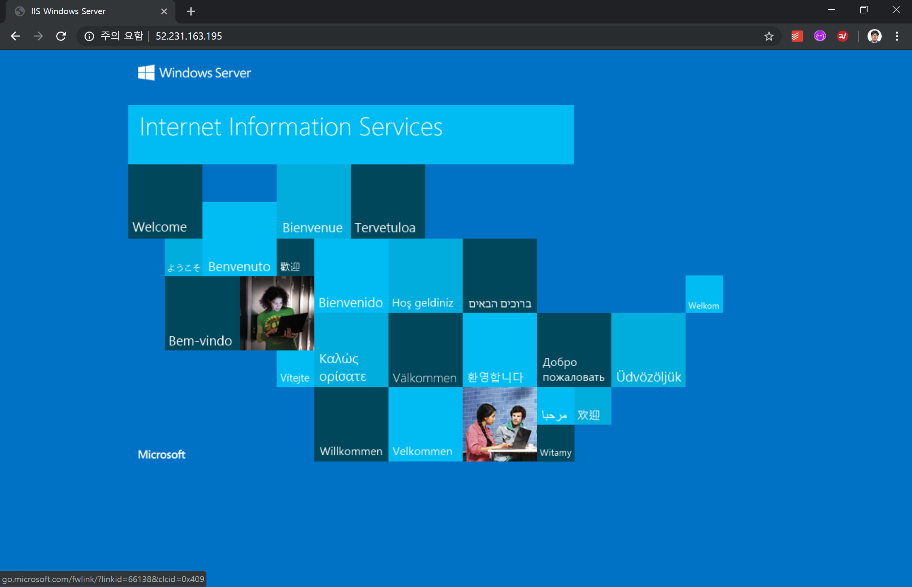

# 배포에 필요한 환경 변수 설정하기

이 핸즈온랩 모듈의 시작부터 끝까지 계속 사용할 주요 정보는 편의를 위하여 변수로 저장하고 사용할 것입니다.

`...` 부분은 적절한 값으로 채워넣습니다. 아래 변수들은 배포가 끝날 때까지 계속 사용될 값이므로 창이나 세션을 갑자기 닫게 될 경우를 대비하여 정보를 잘 보관해두도록 합니다.

```powershell
# 리소스 그룹의 이름을 지정합니다. (예: k8s-win1)
$resourceGroup = "..."

# 사용할 데이터센터의 위치를 지정합니다. 원하는 다른 위치로 변경해도 무방합니다. (예: westus2)
$location = "koreasouth"

# Kubernetes 클러스터에 붙일 고유 도메인 이름에 사용할 DNS 접두사입니다. (예: wink8s1)
$dnsPrefix = "..."

# Windows, Linux 노드에 접속하기 위해 사용할 관리자용 ID입니다.
$adminUserName = "azureuser"

# Windows 노드에만 해당하며, 위의 사용자 계정과 연결된 비밀 번호입니다. RDP 등을 사용할 때 필요할 수 있습니다. 셸 히스토리에 비밀 번호가 남는 것을 방지하기 위하여 다음과 같이 비밀 번호를 자동 생성하도록 합니다.
$windowsPassword = ([char[]]([char]33..[char]95) + ([char[]]([char]97..[char]126)) + 0..9 | sort {Get-Random})[0..16] -join ''
```

# 배포에 사용할 리소스 그룹과 서비스 주체 만들기

AKS Engine으로 만드는 ARM 템플릿 파일을 적용하려면 배포하는 리소스들을 묶는 단위인 리소스 그룹과, 배포 과정 전반에 걸쳐 사용자를 대신하여 작업을 수행할 자동화 작업에 사용할 서비스 주체를 정의해야 합니다.

계속 작업을 진행하기 전에 PowerShell을 시작합니다. Windows에서는 PowerShell을 쉽게 찾아 실행할 수 있으며, Linux와 macOS의 경우는 [Chapter 1](chapter1.md)의 내용을 따라 설치하였으면 `pwsh` 라는 유틸리티가 새로 생성됩니다. 이것을 사용하도록 합니다.

다음의 명령을 실행하여 리소스 그룹을 새로 만듭니다.

```powershell
az group create --location $location --name $resourceGroup
```

리소스 그룹이 생성되면 리소스 그룹의 ID를 변수에 저장합니다.

```powershell
$groupId = (az group show --resource-group $resourceGroup --query id --output tsv)
```

이어서 서비스 주체를 만들고, 관련 정보를 변수에 저장합니다. AKS Engine이 만든 ARM 템플릿을 배포하기 위해서는 Contributor 수준의 역할이 필요하므로 이를 정확하게 지정합니다.

```powershell
$sp = az ad sp create-for-rbac --role="Contributor" --scopes=$groupId | ConvertFrom-JSON
```

# AKS Engine API 모델 만들기

AKS Engine은 JSON으로 구성된 API 모델을 이용하여 ARM 템플릿 파일과 Kubernetes 설정 파일을 생성하는 방식으로 동작합니다. API 모델은 AKS Engine이 독자적으로 사용하는 포맷의 설정 파일이며, 자세한 내용은 [https://github.com/Azure/aks-engine/blob/master/docs/topics/features.md](https://github.com/Azure/aks-engine/blob/master/docs/topics/features.md)의 내용을 참고하세요.

작업 디렉터리가 별도로 분리되어있는 것이 편리하므로 계속 하기 전에 새로운 디렉터리를 사용자 홈 디렉터리 아래에 만들겠습니다.

```powershell
mkdir ~/aks-test/
cd ~/aks-test/
```

이 실습에서 사용하는 API 모델은 다음과 같습니다. 아래 내용을 복사하여 새 파일로 저장하도록 합니다. 여기서는 `apimodel.json` 이라는 이름으로 저장했다고 가정하겠습니다.

```json
{
  "apiVersion": "vlabs",
  "properties": {
    "orchestratorProfile": {
      "orchestratorType": "Kubernetes",
      "orchestratorRelease": "1.15"
    },
    "masterProfile": {
      "count": 2,
      "dnsPrefix": "",
      "vmSize": "Standard_D2_v3"
    },
    "agentPoolProfiles": [
      {
        "name": "linuxpool1",
        "count": 1,
        "vmSize": "Standard_D2_v3",
        "availabilityProfile": "VirtualMachineScaleSets",
        "storageProfile" : "ManagedDisks"
      },
      {
        "name": "windowspool2",
        "count": 1,
        "vmSize": "Standard_D2_v3",
        "availabilityProfile": "VirtualMachineScaleSets",
        "osType": "Windows",
        "storageProfile" : "ManagedDisks"
      }
    ],
    "linuxProfile": {
      "adminUsername": "azureuser",
      "ssh": {
        "publicKeys": [
          {
            "keyData": ""
          }
        ]
      }
    },
    "windowsProfile": {
      "adminUsername": "azureuser",
      "adminPassword": "replacepassword1234$",
      "sshEnabled": true,
      "windowsPublisher": "MicrosoftWindowsServer",
      "windowsOffer": "WindowsServer",
      "windowsSku": "Datacenter-Core-1903-with-Containers-smalldisk",
      "imageVersion": "1903.0.20190603",
      "enableAutomaticUpdates": false
    },
    "servicePrincipalProfile": {
      "clientId": "",
      "secret": ""
    },
    "extensionProfiles": [
      {
        "name": "winrm",
        "version": "v1"
      }
    ]
  }
}
```

이제 위의 API Model을 PowerShell에서 읽어 프로그래밍 방식으로 편집하고 완성된 API Model 파일로 다시 저장해야 합니다.

그리고 앞에서 만든 JSON 파일을 불러와 Object로 역직렬화합니다.

```powershell
$inJson = Get-Content ./apimodel.json | ConvertFrom-Json
```

Kubernetes 클러스터의 DNS Prefix를 지정합니다.

```powershell
$inJson.properties.masterProfile.dnsPrefix = $dnsPrefix
```

Linux 노드에 접속할 때 사용할 관리자 ID와 SSH 공개 키를 지정합니다. 여기에 값을 지정하면 Windows 노드에도 SSH 설정이 같이 적용됩니다. (참고: Windows Server 2019부터는 공식적으로 OpenSSH를 사용하여 원격 접속을 할 수 있습니다. 자세한 내용은 [https://github.com/Azure/aks-engine/blob/master/docs/topics/clusterdefinitions.md](https://github.com/Azure/aks-engine/blob/master/docs/topics/clusterdefinitions.md)를 참고하세요.)

```powershell
$inJson.properties.linuxProfile.adminUsername = $adminUserName
$inJson.properties.linuxProfile.ssh.publicKeys[0].keyData = [string](Get-Content "~/.ssh/id_rsa.pub")
```

Windows OS의 경우 여전히 관리자 ID와 비밀 번호를 지정해주어야 합니다.

```
$inJson.properties.windowsProfile.adminUsername = $adminUserName
$inJson.properties.windowsProfile.adminPassword = $windowsPassword
```

마지막으로 서비스 주체에 대한 정보를 지정해주어야 합니다.

```powershell
$inJson.properties.servicePrincipalProfile.clientId = $sp.appId
$inJson.properties.servicePrincipalProfile.secret = $sp.password
```

내용이 채워진 JSON 파일을 다시 파일로 기록하여 AKS-Engine이 사용할 수 있게 만듭니다.

```powershell
$inJson | ConvertTo-Json -Depth 10 | Out-File -Encoding ascii -FilePath "apimodel-complete.json"
```

# 실제 클러스터에 배포하기

이제 위의 API Model 파일을 ARM 템플릿으로 AKS 엔진을 사용하여 변환해야 합니다.

```powershell
aks-engine.exe generate apimodel-complete.json
```

위와 같이 실행하면 `apimodel-complete.json` 파일이 만들어진 위치 아래에 `_output/$dnsPrefix/kubeconfig` 폴더가 만들어지고 이 안에 Azure 배포에 필요한 모든 콘텐츠들이 만들어지게 됩니다. 이제 이것을 Azure CLI를 통해 배포하도록 하겠습니다.

```powershell
az group deployment create --name "$resourceGroup-deploy" --resource-group "$resourceGroup" --template-file "./_output/$dnsPrefix/azuredeploy.json" --parameters "./_output/$dnsPrefix/azuredeploy.parameters.json"
```

배포에는 시간이 다소 소요됩니다. 모든 작업이 완료되면 출력되는 결과 JSON 콘텐츠의 `outputs` 프로퍼티 아래에 다음과 같이 `masterFQDN` 값이 표시됩니다. 나중에 관리 목적으로 원격 접속을 할 때 이 주소가 필요합니다.

```json
...
      "masterFQDN": {
        "type": "String",
        "value": "wink8s1.westus2.cloudapp.azure.com"
      },
...
```

이제 클러스터에 노드가 잘 배포되었는지 확인하기 위하여 `KUBECONFIG` 환경 변수를 설정하고 `kubectl`을 실행해보도록 하겠습니다.

```powershell
$env:KUBECONFIG=(Get-Item ".\_output\$dnsPrefix\kubeconfig\kubeconfig.$location.json").FullName

kubectl get node -o wide
```

아래와 비슷하게 표시되면 정상적으로 Kubernetes 클러스터가 만들어진 것입니다.

```powershell
PS C:\Users\rkttu\aks-test> kubectl get nodes -o wide                                                                                               NAME                                 STATUS    ROLES     AGE       VERSION   EXTERNAL-IP   OS-IMAGE                    KERNEL-VERSION      CONTAINER-RUNTIME
2856k8s01000000                      Ready     agent     4m        v1.15.0   <none>        Windows Server Datacenter   10.0.18362.116      docker://18.9.2
2856k8s01000001                      Ready     agent     4m        v1.15.0   <none>        Windows Server Datacenter   10.0.18362.116      docker://18.9.2
k8s-linuxpool1-28563840-vmss000000   Ready     agent     7m        v1.15.0   <none>        Ubuntu 16.04.6 LTS          4.15.0-1050-azure   docker://3.0.6
k8s-linuxpool1-28563840-vmss000001   Ready     agent     7m        v1.15.0   <none>        Ubuntu 16.04.6 LTS          4.15.0-1050-azure   docker://3.0.6
k8s-master-28563840-0                Ready     master    7m        v1.15.0   <none>        Ubuntu 16.04.6 LTS          4.15.0-1050-azure   docker://3.0.6
k8s-master-28563840-1                Ready     master    8m        v1.15.0   <none>        Ubuntu 16.04.6 LTS          4.15.0-1050-azure   docker://3.0.6
k8s-master-28563840-2                Ready     master    7m        v1.15.0   <none>        Ubuntu 16.04.6 LTS          4.15.0-1050-azure   docker://3.0.6
```

# 테스트 애플리케이션 배포하기

배포가 잘 되었는지 확인하기 위하여 IIS 컨테이너를 새로 만든 Kubernetes 클러스터에 배포해포겠습니다. 아래의 텍스트를 `iis.yml` 이라는 이름으로 저장했다고 가정하겠습니다.

```yaml
apiVersion: apps/v1
kind: Deployment
metadata:
  name: iis-19h1
  labels:
    app: iis-19h1
spec:
  replicas: 1
  template:
    metadata:
      name: iis-19h1
      labels:
        app: iis-19h1
    spec:
      containers:
      - name: iis
        image: mcr.microsoft.com/windows/servercore/iis:windowsservercore-1903
        resources:
          limits:
            cpu: 1
            memory: 800m
          requests:
            cpu: .1
            memory: 300m
        ports:
          - containerPort: 80
      nodeSelector:
        "beta.kubernetes.io/os": windows
  selector:
    matchLabels:
      app: iis-19h1
---
apiVersion: v1
kind: Service
metadata:
  name: iis
spec:
  type: LoadBalancer
  ports:
  - protocol: TCP
    port: 80
  selector:
    app: iis-19h1
```

`kubectl` 명령을 사용하여 배포를 진행하겠습니다.

```powershell
kubectl apply -f iis.yml
```

> **노트** 만약 다음과 유사한 오류 메시지가 나타나면 설치된 `kubectl`의 버전이 오래된 것이 원인일 수 있습니다. `kubectl version` 명령을 실행하여 버전을 확인하고, 업그레이드를 진행하도록 합니다.

```
error: SchemaError(io.k8s.api.apps.v1beta2.ReplicaSetSpec): invalid object doesn't have additional properties
```

배포 후에는 컨테이너의 상태가 `ContainerCreating` 에서 `Ready`로 변경될 때 까지 기다립니다. 처음에는 Base Image를 받기 위해 약 10분에서 15분 정도 소요됩니다.

```powershell
kubectl get pods --watch
NAME                        READY     STATUS              RESTARTS   AGE
iis-19h1-6c49777598-h45cs   0/1       ContainerCreating   0          1m
```

다음으로 `iis` 로드밸런서의 External IP가 `<pending>` 상태에서 IP 주소가 나타날 때까지 계속 상태를 확인하도록 합니다.

```powershell
kubectl get services --watch
NAME         TYPE           CLUSTER-IP   EXTERNAL-IP   PORT(S)        AGE
iis          LoadBalancer   10.0.9.47    <pending>     80:31240/TCP   1m
kubernetes   ClusterIP      10.0.0.1     <none>        443/TCP        46m
```

`iis` 로드밸런서의 IP가 나타나면 웹 브라우저를 열어 그 주소로 접속해봅니다. 아래 그림과 같이 표시되면 정상적으로 IIS 컨테이너가 실행된 것입니다.



여기까지 진행하였으면 [다음 Chapter](chapter3.md)로 이동합니다.
