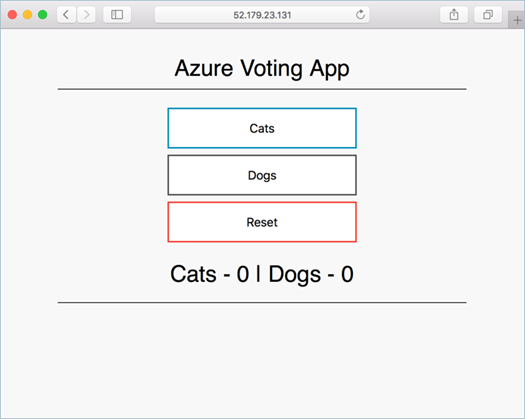

# 지금까지 한 일

지금까지 배포한 인프라의 배포 다이어그램은 다음과 같은 모양입니다.


아래는 모두 AKS Engine에서 만든 Azure Resource Manager 템플릿을 사용하여 자동으로 생성되었습니다.

- 마스터 컴포넌트: 마스터는 Kubernetes 스케줄러, API 서버 및 컨트롤러 관리자를 실행합니다. 포트 443은 kubectl CLI 툴로 원격 관리가 가능합니다.
- Linux 및 Windows 노드: Kubernetes 노드는 가상 머신 스케일 세트에서 실행됩니다. Azure 로드 밸런서는 노출 된 서비스에 따라 클러스터에 동적으로 추가됩니다.
- 공용 컴포넌트: 모든 VM은 kubelet, kube-proxy, 그리고 Docker를 실행합니다.
- 네트워킹: 모든 가상 컴퓨터는 `10.240.0.0/16` CIDR 대역에서 IP를 할당받으며, 서로 간에 접속할 수 있습니다.

# 하이브리드 클러스터를 사용하는 애플리케이션 배포하기

실제로 서로 다른 종류의 노드를 골고루 사용하는 하이브리드 애플리케이션이 잘 작동하는지 확인하기 위하여, AzureVote 샘플 애플리케이션을 조금 다르게 구성한 버전을 만들어 배포를 테스트해보려고 합니다.

AzureVote 샘플 앱은 프론트엔드로 Python 3로 작성되어있으며, 백엔드로 Redis를 사용합니다. 정상적으로 애플리케이션이 시작되면 다음과 같은 화면이 표시됩니다. 실행 환경에 문제가 있으면 화면이 표시되지 않습니다.



여기서 백엔드 Redis를 Microsoft Open Tech에서 릴리스했던 Windows 버전의 Redis 컨테이너로 변경하여 실행하려고 합니다.

다음과 같이 YAML 파일을 만들겠습니다. 파일 이름은 `azurevote.yml` 로 저장한다고 가정하겠습니다.

```yaml
apiVersion: apps/v1beta1
kind: Deployment
metadata:
  name: azure-vote-back
spec:
  replicas: 1
  template:
    metadata:
      labels:
        app: azure-vote-back
    spec:
      containers:
      - name: azure-vote-back
        image: rkttu/redis-windows:3.0-1903
        ports:
        - containerPort: 6379
          name: redis
      nodeSelector:
        "beta.kubernetes.io/os": windows
---
apiVersion: v1
kind: Service
metadata:
  name: azure-vote-back
spec:
  ports:
  - port: 6379
  selector:
    app: azure-vote-back
---
apiVersion: apps/v1beta1
kind: Deployment
metadata:
  name: azure-vote-front
spec:
  replicas: 1
  strategy:
    rollingUpdate:
      maxSurge: 1
      maxUnavailable: 1
  minReadySeconds: 5 
  template:
    metadata:
      labels:
        app: azure-vote-front
    spec:
      containers:
      - name: azure-vote-front
        image: microsoft/azure-vote-front:v1
        ports:
        - containerPort: 80
        resources:
          requests:
            cpu: 250m
          limits:
            cpu: 500m
        env:
        - name: REDIS
          value: "azure-vote-back"
      nodeSelector:
        "beta.kubernetes.io/os": linux
---
apiVersion: v1
kind: Service
metadata:
  name: azure-vote-front
spec:
  type: LoadBalancer
  ports:
  - port: 80
  selector:
    app: azure-vote-front
```

위의 YML 파일을 다음의 명령으로 배포합니다.

```
kubectl apply -f azurevote.yml
NAME                                READY   STATUS              RESTARTS   AGE                                                    azure-vote-back-6797f49554-v52kl    0/1     ContainerCreating   0          5s                                                     azure-vote-front-559d85d4f7-8dl9z   0/1     ContainerCreating   0          5s                                                     iis-19h1-85d5bb7558-857g7           1/1     Running             0          5h13m                                                  azure-vote-front-559d85d4f7-8dl9z   1/1     Running             0          53s                                                    azure-vote-back-6797f49554-v52kl    1/1     Running             0          78s            
```

그리고 로드밸런서가 초기화되어 IP가 할당되기까지 아래 명령을 사용하여 결과를 확인하고 기다립니다.

```
kubectl get svc --watch
NAME               TYPE           CLUSTER-IP     EXTERNAL-IP      PORT(S)        AGE
azure-vote-back    ClusterIP      10.0.162.176   <none>           6379/TCP       86s
azure-vote-front   LoadBalancer   10.0.99.224    52.231.165.172   80:31508/TCP   86s
iis                LoadBalancer   10.0.223.9     52.231.163.195   80:30581/TCP   5h14m
kubernetes         ClusterIP      10.0.0.1       <none>           443/TCP        5h44m
```

IP 주소가 나타나면 웹 브라우저를 열어 접속한 후, 임의로 버튼을 눌렀을 때 값이 증가하는지 확인해봅니다.


# 마무리

모든 실습이 완료되었습니다. 새로 만든 Kubernetes 클러스터를 사용하지 않는다면 아래 명령을 사용하여 해당 리소스 그룹을 정리하도록 합니다. (`$resourceGroup` 환경 변수는 [이전 단원](chapter2.md)에서 정의했던 것입니다.)

```powershell
az group delete $resourceGroup
```
